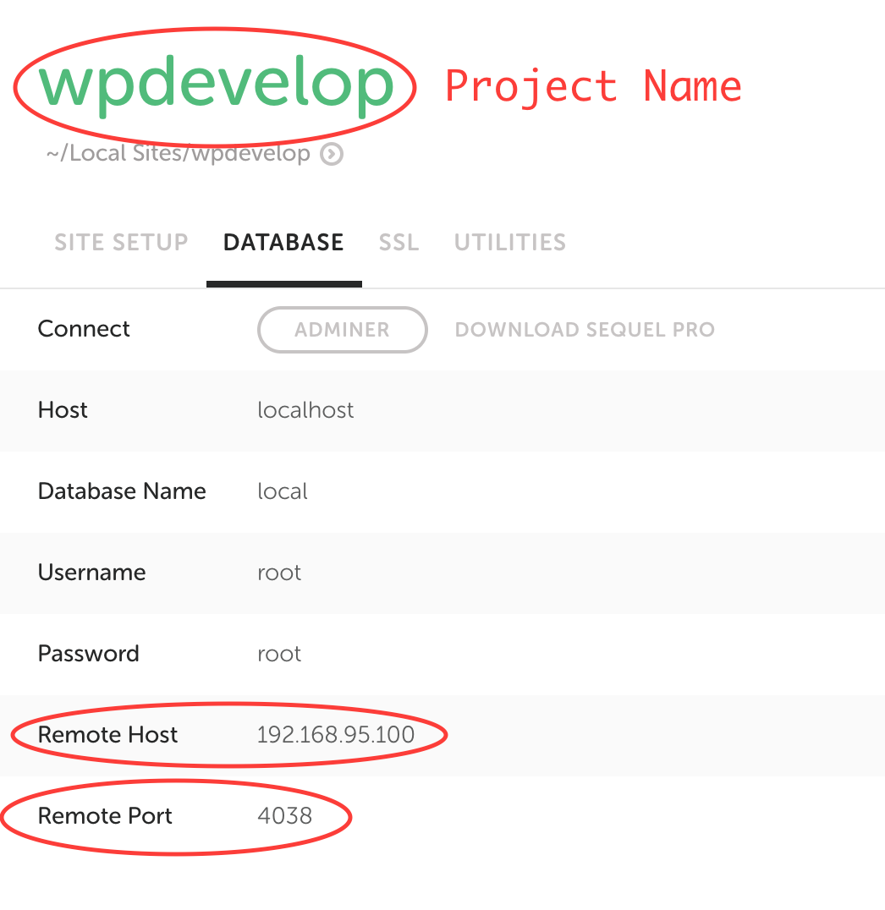

When you want to use [WP-CLI](http://wp-cli.org/) for site in [Local by Flywheel](https://local.getflywheel.com/), you need to use “Open Site SSH” which would open a new instance of your command line app and run WP-CLI provided by Local.

But, it is possible to use your own installation of WP-CLI, just like for any other site (for example, inside [Terminal in Visual Studio Code](https://code.visualstudio.com/docs/editor/integrated-terminal)).

## Usage

It is assumed that all sites are stored inside one directory (by default, this directory is `~/Local Sites`). Inside of that directory, you should copy file `wp-cli.local.sh` from this repository. Whenever you want to setup WP-CLI for a new site, you run following command from the command line:

```bash
bash wp-cli.local.sh <project-name> <db-host-ip> <db-host-port>
```

where:

- `<project-name>` is the name of the site
- `<db-host-ip>` is “Remote Host“ value of site’s database
- `<db-host-port>` is “Remote Port value of site’s database

This screenshot shows what information you should get from Local:



When you run command from above, it will create `wp-cli.local.php` and `wp-cli.local.yml` files inside of project’s directory, and you can start using WP-CLI when inside it or its child directories.
